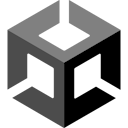

<h1 align=center>Hey👋   I'm Goramax</h1>

## Socials :

&nbsp;

<!--  -->

## Languages & frameworks
### Languages

&nbsp;

&nbsp;

&nbsp;

&nbsp;

### Frameworks

&nbsp;

&nbsp;

&nbsp;

&nbsp;

### DBMS

&nbsp;

### Other tools

&nbsp;

&nbsp;

&nbsp;

&nbsp;

&nbsp;

&nbsp;

&nbsp;

## Certifications
||
|:---:|
|905/1000|
